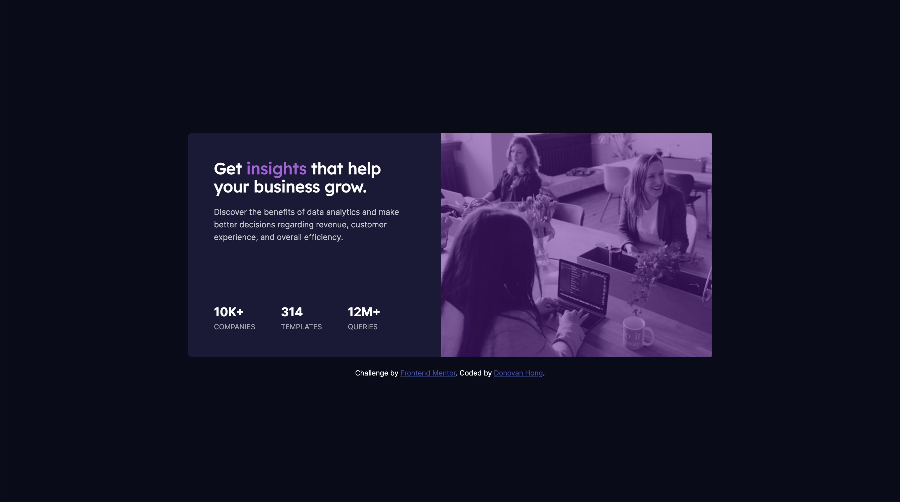

# Frontend Mentor - Stats preview card component solution

This is a solution to the [Stats preview card component challenge on Frontend Mentor](https://www.frontendmentor.io/challenges/stats-preview-card-component-8JqbgoU62). Frontend Mentor challenges help you improve your coding skills by building realistic projects.

## Table of contents

- [Overview](#overview)
  - [The challenge](#the-challenge)
  - [Screenshot](#screenshot)
  - [Links](#links)
- [My process](#my-process)
  - [Built with](#built-with)
  - [What I learned](#what-i-learned)
- [Author](#author)

## Overview

### The challenge

Users should be able to:

- View the optimal layout depending on their device's screen size

### Screenshot

### Links

- Live Site URL: [live site URL here](https://deadstocky.github.io/fm-stats-preview-card-component/)

## My process

### Built with

- Semantic HTML5 markup
- CSS custom properties
- Flexbox
- CSS Grid
- Mobile-first workflow

### What I learned

- Adding overlays to images is trickier than I remembered. Always thought a simple background-blend-mode would do the trick but styling div's with background-image is a lot more difficult and comes with far too many drawbacks. You end up dealing with a lot workarounds for positioning than creating the overlay. Tip: always use a div positioned over an img in order to achieve an overlay effect.
- Learned more about screen readers and aria-labels. Found it useful to actually use VoiceOver and navigate the component to see what was missing. Interesting to see that VoiceOver reads span text individually rather than the whole div.

## Author

- Website - [Donovan Hong](https://www.donovanhong.com)
- Frontend Mentor - [@deadstocky](https://www.frontendmentor.io/profile/deadstocky)
- Twitter - [@deadstocky](https://www.twitter.com/deadstocky)
